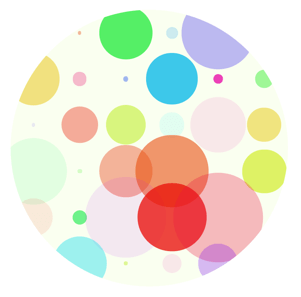

# css-doodle (wip)

A web component for drawing patterns with css.



```html
<css-doodle grid="5">
  :doodle {
    border-radius: 50%;
    overflow: hidden;
    background: #f1ffd9;
  }

  --size: @rand(200%);
  width: var(--size);
  height: var(--size);
  border-radius: 50%;
  background-color: hsla(
    @rand(100), 80%, 50%, @rand(.8)
  );
</css-doodle>
```

## Usage

include css-doodle.js in your html:

```
<script src="./css-doodle.js"></script>
```
