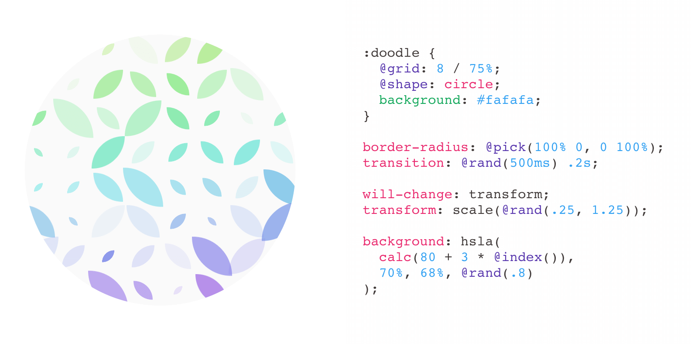

# &lt;css-doodle /&gt;

[](https://travis-ci.org/css-doodle/css-doodle)

[](https://spectrum.chat/css-doodle)


A web component for drawing patterns with CSS.

<a href="https://css-doodle.com/">
  
</a>

## Docs
[https://css-doodle.com](http://css-doodle.com)


## Resources

* [Creating Patterns Using CSS & the &lt;css-doodle /&gt; Web Component](https://alligator.io/css/patterns-css-doodle/)
* [Bokeh Backgrounds with CSS-Doodle](https://www.timothyellison.com/2018/05/27/bokeh-backgrounds-with-css-doodle/), by Tim Ellison
* [How to Draw Patterns with CSS Using CSS Doodle](https://webdesign.tutsplus.com/tutorials/how-to-draw-patterns-with-css-using-css-doodle--cms-33110), by Adi Purdila


## Build

```bash
# build css-doodle.js
npm run build

# generate css-doodle.min.js
npm run minify && npm run trim

# or just use make
make
```
