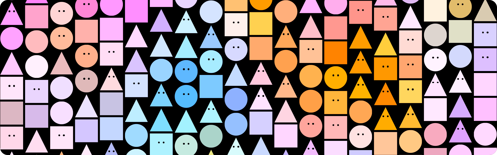
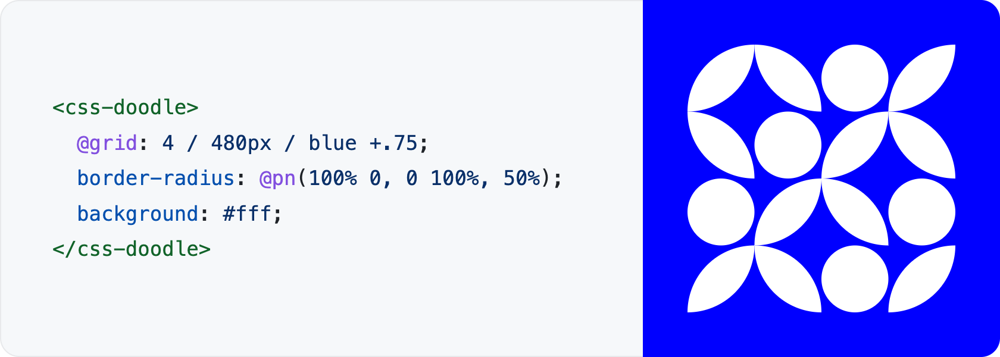

<a href="https://css-doodle.com/new/?code=%40grid%3A%201%20%2F%20100%25%3B%0A%40seed%3A%201757726655292%3B%0Abackground-size%3A%20cover%3B%0Abackground-image%3A%20%40doodle2000(%0A%20%20%20%20%40grid%3A%2028%20%2F%20100%25%20%5E1.4%20_8px%20%7C%20%40svg-filter(.016%2C%20500)%3B%0A%20%20%20%20background%3A%20oklab(%0A%20%20%20%20%20%20%20%20%40r(80%25%2C%20100%25)%0A%20%20%20%20%20%20%20%20%40rn(-50%25%2C%20100%25%2C%203)%0A%20%20%20%20%20%20%20%20%40rn(-100%25%2C%20100%25%2C%205)%0A%20%20%20%20)%3B%0A%20%20%20%20translate%3A%200%20calc(%40sin(%40dx)%20*%20100px)%3B%0A%20%20%20%20clip-path%3A%20%40p(%0A%20%20%20%20%20%20%20%20circle(50%25)%2C%0A%20%20%20%20%20%20%20%20polygon(50%25%200%2C%20100%25%20100%25%2C%200%20100%25)%2C%0A%20%20%20%20%20%20%20%20none%0A%20%20%20%20)%3B%0A%20%20%20%20%40keyframes%20blink%20%7B%0A%20%20%20%20%20%20%20%2096%25%20%7B%0A%20%20%20%20%20%20%20%20%20%20%20%20clip-path%3A%20polygon(-1%25%2050%25%2C%20101%25%2050%25%2C%20101%25%2050%25%2C%20-1%25%2050%25)%3B%0A%20%20%20%20%20%20%20%20%7D%0A%20%20%20%20%20%20%20%2094%25%2C%20100%25%20%7B%0A%20%20%20%20%20%20%20%20%20%20%20%20clip-path%3A%20polygon(-1%25%20-1%25%2C%20101%25%20-1%25%2C%20101%25%20101%25%2C%20-1%25%20101%25)%3B%0A%20%20%20%20%20%20%20%20%7D%0A%20%20%20%20%7D%0A%20%20%20%20%40random(.4)%20%7B%0A%20%20%20%20%20%20%20%20--s%3A%20-%40r(5s)%3B%0A%20%20%20%20%20%20%20%20--t%3A%20%40r(3s%2C%205s)%3B%0A%20%20%20%20%20%20%20%20%3A%3Abefore%2C%20%3A%3Aafter%20%7B%0A%20%20%20%20%20%20%20%20%20%20%20%20content%3A%20''%3B%0A%20%20%20%20%20%20%20%20%20%20%20%20%40size%3A%208%25%3B%0A%20%20%20%20%20%20%20%20%20%20%20%20aspect-ratio%3A%201%3B%0A%20%20%20%20%20%20%20%20%20%20%20%20%40place%3A%20%40pn(40%25%2C%2060%25)%2040%25%3B%0A%20%20%20%20%20%20%20%20%20%20%20%20border-radius%3A%2050%25%3B%0A%20%20%20%20%20%20%20%20%20%20%20%20background%3A%20%23000%3B%0A%20%20%20%20%20%20%20%20%20%20%20%20animation%3A%20blink%20var(--t)%20var(--s)%20ease-out%20infinite%3B%0A%20%20%20%20%20%20%20%20%7D%0A%20%20%20%20%7D%0A)%3B"></a>

<h1>css-doodle</h1>

A web component for visual art and creative coding with CSS.
Write CSS rules for a grid of cells, mix in randomness and math,
and draw generative patterns, backgrounds, icons and decorations.

<p>
  <a href="https://www.npmjs.com/package/css-doodle"></a>
  <a href="LICENSE"></a>
  <a href="https://opencollective.com/css-doodle"></a>
</p>

<p>
  <a href="https://css-doodle.com">Website</a> ·
  <a href="https://css-doodle.com/getting-started/">Getting started</a> ·
  <a href="https://css-doodle.com/reference/">Reference</a> ·
  <a href="https://css-doodle.com/new/">Playground</a> ·
  <a href="https://css-doodle.com/discover/">Discover</a>
</p>

## Example 

<a href="https://css-doodle.com/new/?code=%40grid%3A%204%20%2F%20480px%20%2F%20blue%20%2B.75%3B%0Aborder-radius%3A%20%40pn(100%25%200%2C%200%20100%25%2C%2050%25)%3B%0Abackground%3A%20%23fff%3B"></a>

## Tools

* [Playground](https://css-doodle.com/new/): write and share doodles in the browser
* [Shapes](https://css-doodle.com/shapes/): discover new CSS polygon shapes
* [SVG playground](https://css-doodle.com/svg/): generate SVG code with the same syntax
* [cssd](https://github.com/css-doodle/cli): command-line preview and image/video export

## Articles and talks

* **[An Introduction to css-doodle](https://yuanchuan.dev/an-introduction-to-css-doodle)**<br>
  Article by Yuan Chuan, 2024. How the project started, from recreating a Dribbble
  pattern with a grid of elements to a tool for generative art. Written up from a
  Groove meetup talk; the [slides](https://github.com/yuanchuan/intro-to-css-doodle) are on GitHub.
* **[Experimenting A New Syntax To Write SVG](https://yuanchuan.dev/experimenting-a-new-syntax-to-write-svg)**<br>
  Article by Yuan Chuan, 2022. The idea behind `@svg`: writing SVG with CSS syntax.
* **[Arte generativo con CSS](https://www.youtube.com/watch?v=KKg6Uo1pVLU)**<br>
  Talk by Sonia Ruiz, 2020, in Spanish (31 min). An introduction to generative
  art, where algorithms produce the work, made with CSS.
* **[How to Draw Patterns with CSS Using CSS Doodle](https://webdesign.tutsplus.com/how-to-draw-patterns-with-css-using-css-doodle--cms-33110t)**<br>
  Tutorial by Adi Purdila on Envato Tuts+, 2019. Installs css-doodle, then builds
  four demos step by step with `@grid`, `@size` and random values from `@r()`.

## Who uses css-doodle

* [Tabbied](https://tabbied.com): generated patterns for prints and wallpapers

## Development

```bash
npm install
npm test         # unit tests
npm run build    # css-doodle.min.js
```

`make` runs both.

## Support

css-doodle is free and MIT licensed. If it has been useful to you, consider
[backing it on Open Collective](https://opencollective.com/css-doodle). Thank you! 🙏

<a href="https://opencollective.com/css-doodle#backers" target="_blank"></a>
<a href="https://opencollective.com/css-doodle#sponsors" target="_blank"></a>
